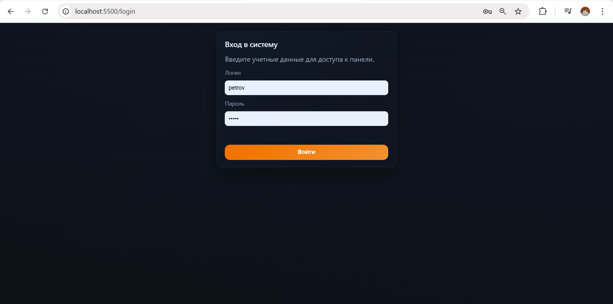
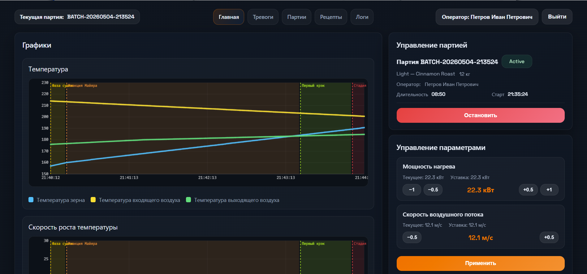
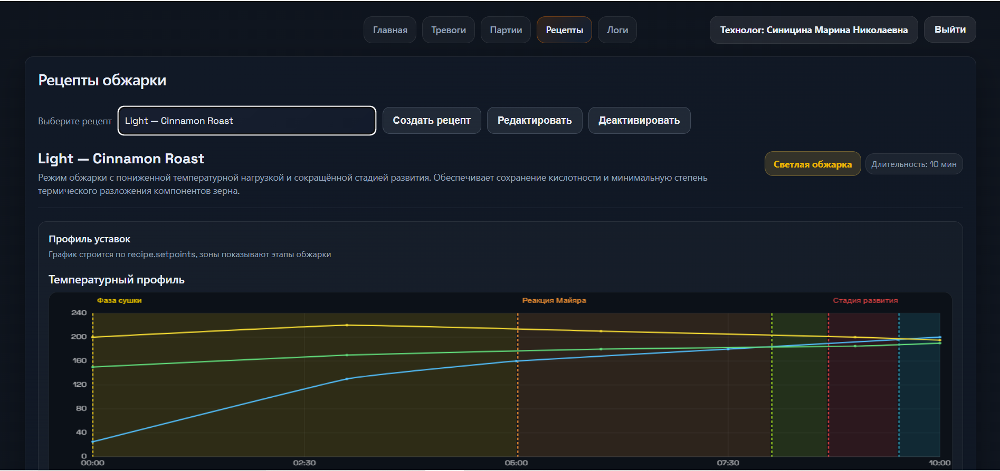
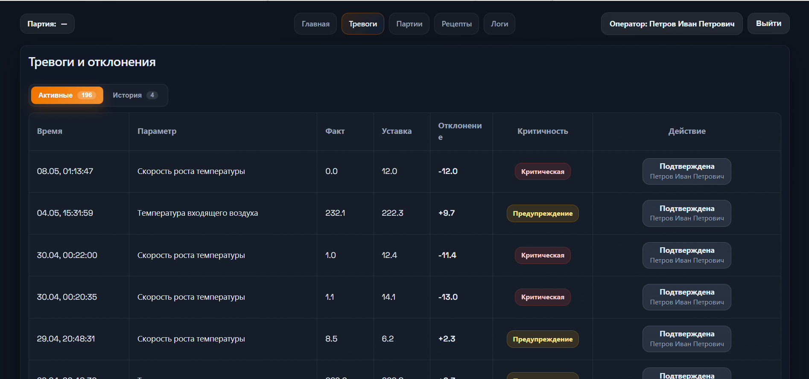
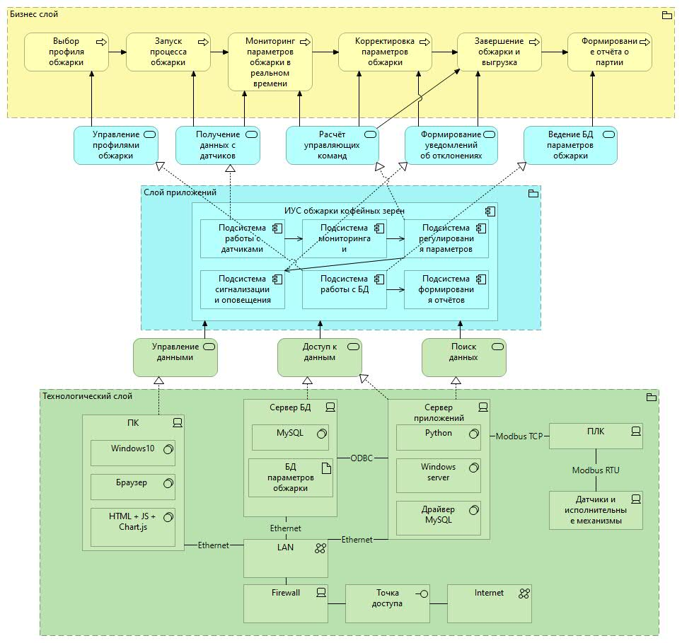
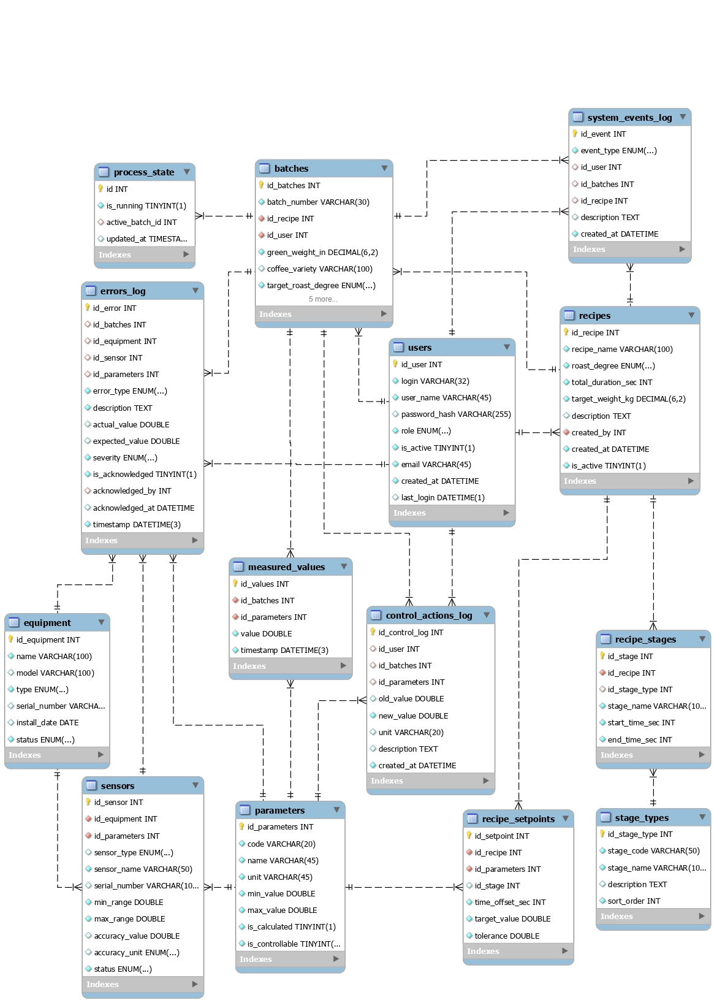

# Industrial Monitoring and Control System for Coffee Bean Roasting

Bachelor's capstone project focused on the design and implementation of an industrial monitoring and control system for the coffee bean roasting process.

The system provides real-time monitoring of roasting parameters, recipe management, batch tracking, alarm generation, and visualization of process data through a web-based interface.

---

## Overview

The project simulates the operation of a coffee roasting control system used in industrial production. It allows operators to monitor technological parameters, compare them with recipe setpoints, detect deviations, and manage roasting batches.

The application follows a client-server architecture with a MySQL database and REST API.

---

## Technologies

### Backend

- Node.js
- Express.js
- MySQL

### Frontend

- HTML5
- CSS3
- JavaScript
- Chart.js

### Other

- Git
- GitHub
- Docker (optional)

---

## Main Features

- User authentication and authorization
- Role-based access control
- Real-time monitoring of roasting parameters
- Recipe management
- Batch management
- Alarm and deviation detection
- Manual adjustment of control parameters
- Event and action logging
- Historical roasting data
- Interactive process visualization

---

## Monitored Parameters

The system continuously monitors:

- Inlet air temperature
- Outlet air temperature
- Bean temperature
- Rate of Rise (RoR)

Operators can adjust:

- Heating power
- Airflow speed

---

## System Architecture

The application consists of three main components:

- **Frontend** — HTML, CSS, JavaScript
- **Backend** — Node.js + Express REST API
- **Database** — MySQL

---

## Screenshots

### Login



### Dashboard



### Recipe Management



### Alarm Monitoring



---

## System Architecture Diagram



---

## Database Schema



---

## Repository Structure

```
.
├── api/                # Backend (Express API)
├── assets/             # JavaScript and CSS files
├── database/           # SQL database schema
├── images/             # README images
├── index.html
├── login.html
├── alarms.html
├── recipes.html
├── batches.html
└── README.md
```

---

## Project Highlights

- Industrial process monitoring
- Relational database design
- REST API development
- Real-time data visualization
- Recipe-driven process control
- Alarm management
- Client-server architecture
