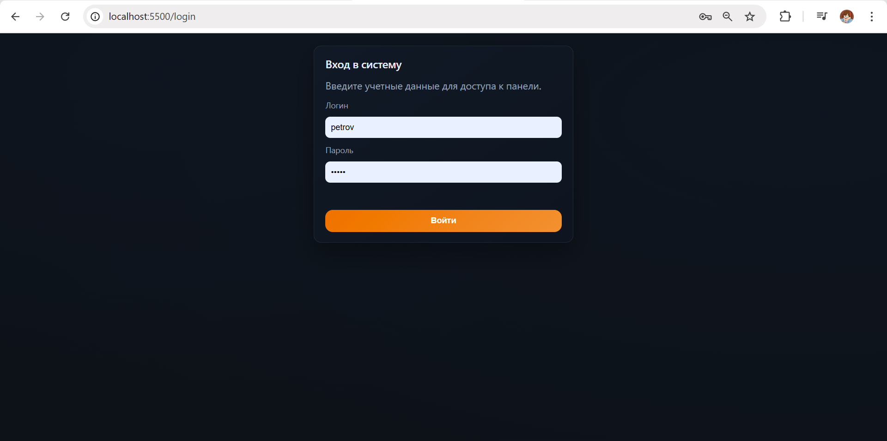
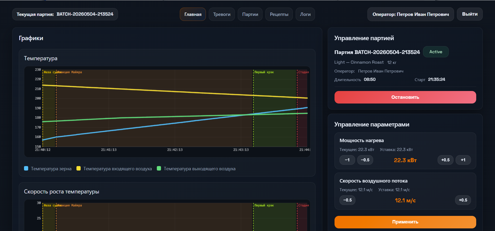
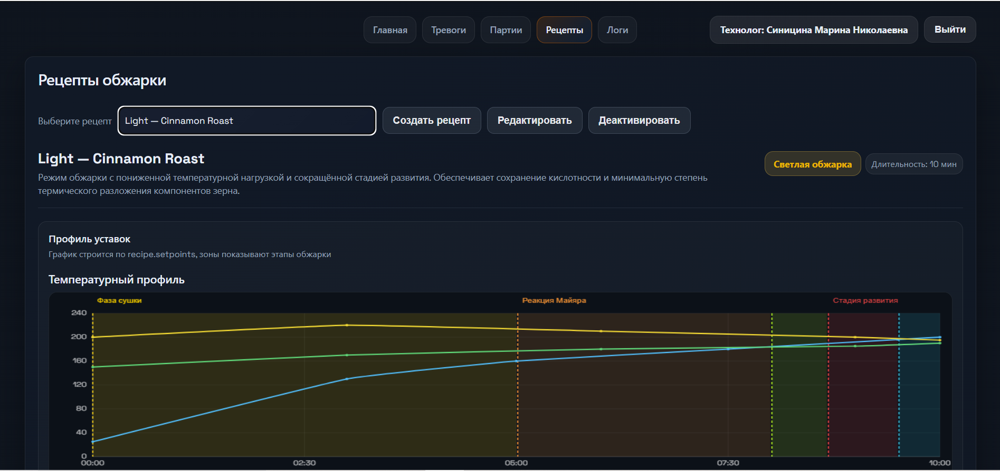
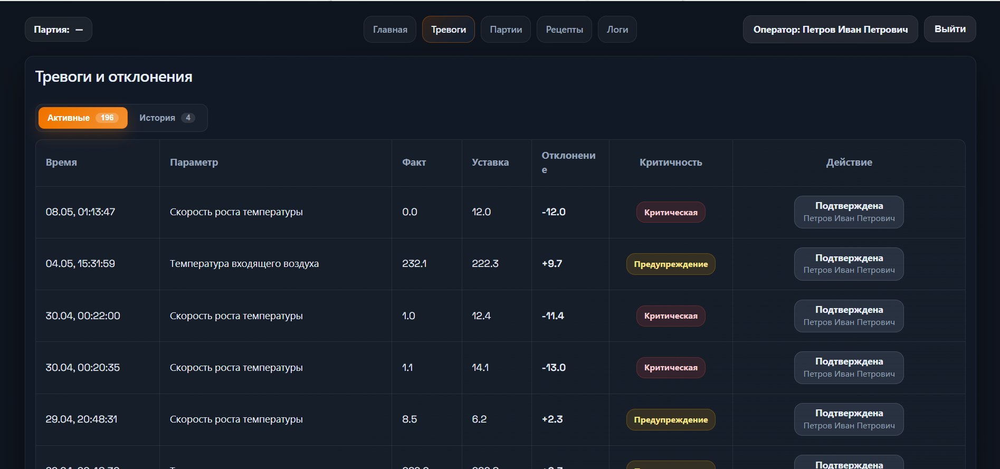
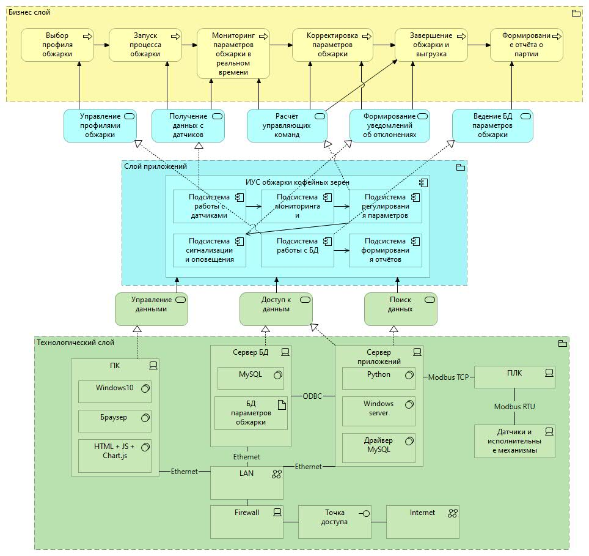
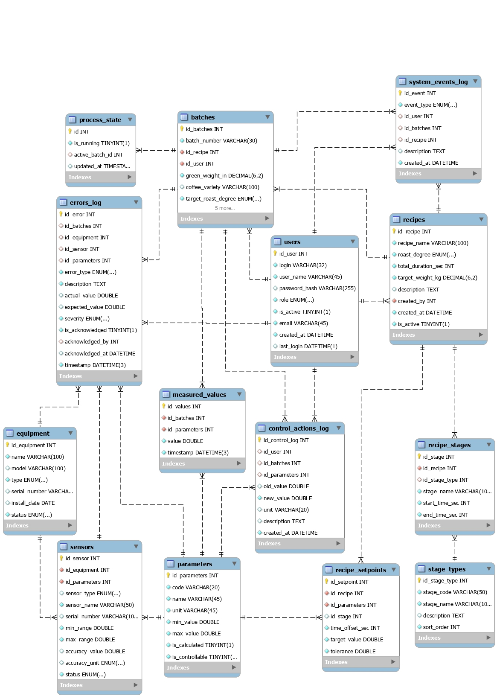

# Coffee Roasting Monitoring & Control System

Bachelor's capstone project focused on the design and implementation of an
industrial monitoring and control system for the coffee bean roasting process.

The system provides real-time process monitoring, recipe-based roasting control,
batch tracking, alarm management, historical data, and automated XLSX batch reports.

## Windows Demo

A standalone Windows demo is available and can be installed without MySQL,
Node.js, or additional database configuration.

**Download:** [Coffee Roasting Monitoring System v1.0.0](https://github.com/minjinnn1/coffee-roasting-monitoring-system/releases/tag/v1.0.0)
---

## Overview

The project simulates the operation of a coffee roasting monitoring and control system used in industrial production. It allows operators to monitor technological parameters in real time, compare measured values with recipe setpoints, detect deviations, adjust process controls, and manage roasting batches.

The original capstone architecture uses a Node.js/Express backend with a MySQL database, REST API, and WebSocket communication for real-time monitoring. A standalone Windows demo version was later developed using Electron and an embedded SQLite database, allowing the application to run without MySQL or additional database configuration.

The demo uses simulated process data to reproduce the behavior of the roasting process without requiring physical roasting equipment.

---

## Technologies

### Backend

- Node.js
- Express.js
- MySQL

### Frontend

- HTML5
- CSS3
- JavaScript
- Chart.js

### Other

- Git
- GitHub
- Docker (optional)

---

## Main Features

- User authentication and authorization
- Role-based access control
- Real-time monitoring of roasting parameters
- Recipe management
- Batch management
- Alarm and deviation detection
- Manual adjustment of control parameters
- Event and action logging
- Historical roasting data
- Interactive process visualization

---

## Monitored Parameters

The system continuously monitors:

- Inlet air temperature
- Outlet air temperature
- Bean temperature
- Rate of Rise (RoR)

Operators can adjust:

- Heating power
- Airflow speed

---

## System Architecture

The application consists of three main components:

- **Frontend** — HTML, CSS, JavaScript
- **Backend** — Node.js + Express REST API
- **Database** — MySQL

---

## Screenshots

### Login



### Dashboard



### Recipe Management



### Alarm Monitoring



---

## System Architecture Diagram



---

## Database Schema



---

## Repository Structure

```
.
├── api/                # Backend (Express API)
├── assets/             # JavaScript and CSS files
├── database/           # SQL database schema
├── images/             # README images
├── index.html
├── login.html
├── alarms.html
├── recipes.html
├── batches.html
└── README.md
```

---

## Project Highlights

- Industrial process monitoring
- Relational database design
- REST API development
- Real-time data visualization
- Recipe-driven process control
- Alarm management
- Client-server architecture
